### 汉庭如家2000万条开房记录[\[1\]][1]

### Download

see ./download/download.txt

### ParseResult

一共`20051428`行，不过似乎有`11660`行的数据不太规范，其实里面还是有信息的。
方便起见，这11660行数据不予考虑，即被清洗掉。

1. `Name`字段
    就是名字哒!

2. `CardNo`字段
    1. 看起来没啥意义的说，出现频率为`10105/20039768(0.050%)`。
        * 前1000W行里有546行存在此字段，均以`H`或`G`开头，随后辅以7位数字。
        * 后1000W行里有9569行存在此字段，大部分为10位纯数字。

3. `Descriot`字段
    1. 估计是`Description`的缩写。。。`Description -> Descript -> Descriot`(笑)。
    要知道，qwerty键盘上的"P"和"O"键位很近的说，出现频率为`20337/20039768(0.101%)`。
        * 主要出现字样为价格/客房类型/服务类型，对客人特殊情况的描述等

4. `CtfTp`字段
    1. 估计是`CtfType`的缩写，出现频率为`20038723/20039768(99.995%)`。
    2. 有多种类型：
        * `ID`，`18882852/20038723(94.232%)`，
        * `VSA`，`376856/20038723(1.881%)`，
     
5. `CtfId`字段
    1. 
    2. 数据分布稠密，出现频率为`20039758/20039768(99.999%)`。
    
6.  `Gender`字段
    1. 此列为性别，出现频率为`19577629/20039768(97.694%)`。
    2. 去除无效数据后，按性别统计(暂只有男/女)结果：
    
        
        
7. `Birthday`字段
    1. 此列为生日(其实从身份证号里也能得到)，出现频率为`19942796/20039768(99.516%)`
    2. 去除无效及明显不合理数据后，按年计算生日分布：
    
        
        
8. `Address`字段
    1. 似乎是。。。家庭住址？出现频率为`16641249/20039768(83.041%)`
    2. 去除无效数据后，按地区/区域计算地址分布：
    
        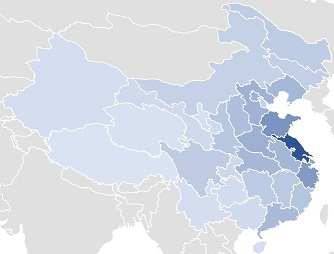
        
        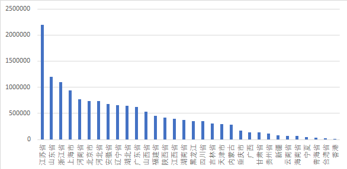

9. `Zip`字段
    1. 大部分是中国大陆地区邮政编码。出现频率为`1702134/20039768(8.494%)`
    2. 去除无效数据和中国大陆外地区后，按地区[\[2\]][2]计算邮政编码分布：
        
        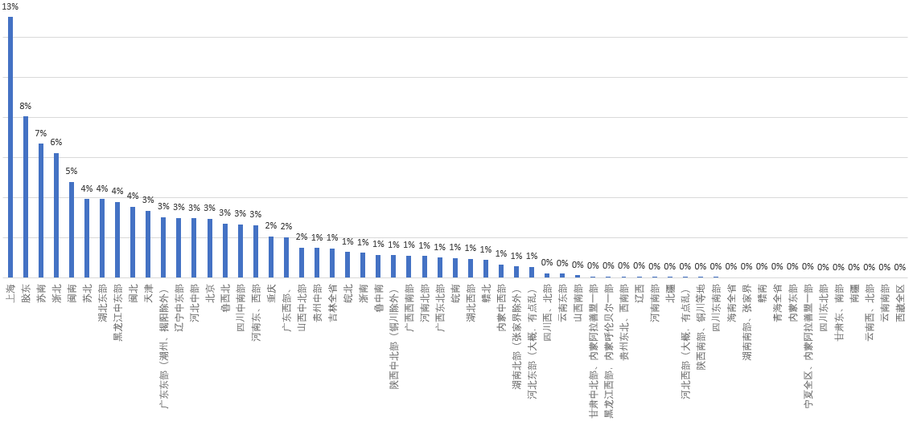
 
10. `Dirty`字段
    1. 不知道啥意思。。。出现频率为`18173499/20039768(90.687%)`
    2. 少部分是一个空格，剩下都是大写字母F（双引号包括部分）。分布：
    
        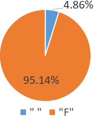

11. `District1`字段
    1. 所在大洲，出现频率为`761491/20039768(3.800%)`
    2. 亚洲人占绝对优势,不过CHN是啥意思。。。分布：
    
        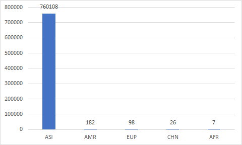

12. `District2`字段
    1. 所在国家/地区，出现频率为`17548292/20039768(87.567%)`
    2. 各个国家/地区都有(ISO3166-1 alpha-3)，但是CHN占绝大部分。取前10展示一下：
    
        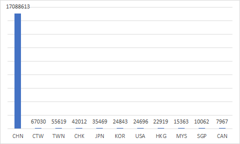

13. `District3`字段
    1. 纯2位数字，莫非是你。。。11区？出现频率为`17250593/20039768(86.082%)
    2. 取前10多的字段类型统计一下：
    
        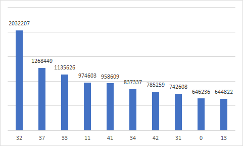

14. `District4`字段
    1. 6位数字居多，但也有4位数字，可能是邮编。出现频率为`16964662/20039768(84.655%)`
    2. 取前10多的字段类型统计一下：
    
        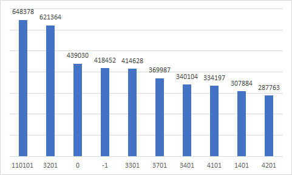
    
15. `District5`字段
    1. 城市，出现频率为`724/20039768(0.004%)`
    
16. `District6`字段
    1. 不知道是什么意思。出现频率为`74/20039768(0.000%)`

17. `FirstNm`字段
    1. FirstName即你的名字。出现频率为`341495/20039768(1.704%)`
    2. 去除无用数据，你们感受一下
    
        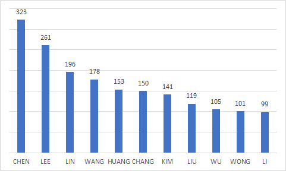

18. `LastNm`字段
    1. LastName即你的姓，不过似乎而变成了名字。出现频率为`993016/20039768(4.955%)`
    2. 去除无用数据，统计出现频率前10的名字。。。又是你，王伟！
    
        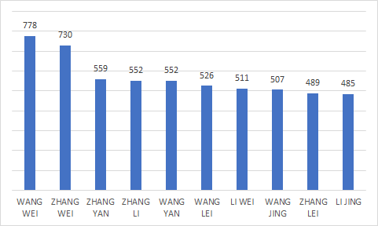

19. `Duty`字段
    1. 你的职业。出现频率为`338042/20039768(1.687%)`
    2. 去除无用数据，统计出现频率前10的职业类型：
        
        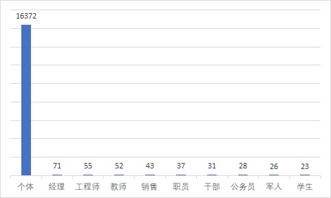

20. `Mobile`字段
    1. 手机号码。出现频率为`7711882/20039768(38.483%)`
    2. 去除无用数据，统计较多出现号段的频率：
    
        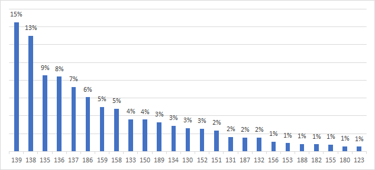
        
    3. 当时，还真是移动的天下呢
        
        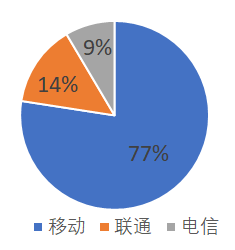

21. `Tel`字段
    1. 电话号码。出现频率为`5402887/20039768(26.961%)`
    
22. `Fax`字段
    1. 传真。出现频率为`1017947/20039768(5.080%)`
    
23. `Email`字段
    1. 电子邮件。出现频率为`2905672/20039768(14.500%)`
    2. 去除无效数据，可以看到当时人们使用何种电子邮件服务：
    
        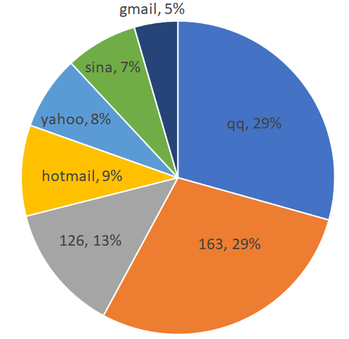

24. `Nation`字段
    1. 民族。出现频率为`13364862/20039768(66.692%)`
    2. 去除无效数据，汉族占绝大多数

        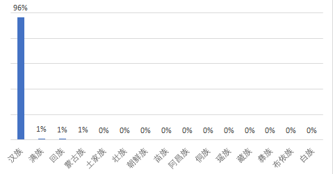

25. `Taste`字段
    1. 客房配置。出现频率为`315871/20039768(1.576%)`
  
26. `Education`字段
    1. 教育背景。出现频率为`309836/20039768(1.546%)`
  
27. `Company`字段
    1. 公司。出现频率为`695487/20039768(3.471%)`
  
28. `CTel`字段
    1. 公司电话。出现频率为`1026/20039768(0.005%)`
    
29. `CAddress`字段
    1. 公司地址。出现频率为`2065/20039768(0.010%)`

30. `CZip`字段
    1. 公司邮编。出现频率为`44449/20039768(0.222%)`

31. `Family`字段
    1. 不太明白，可能是家庭成员数量。出现频率为`19034235/20039768(94.982%)`

32. `Version`字段
    1. 估计是入住时间。
    2. 根据天数统计时间，看来不太平均呢。
    
        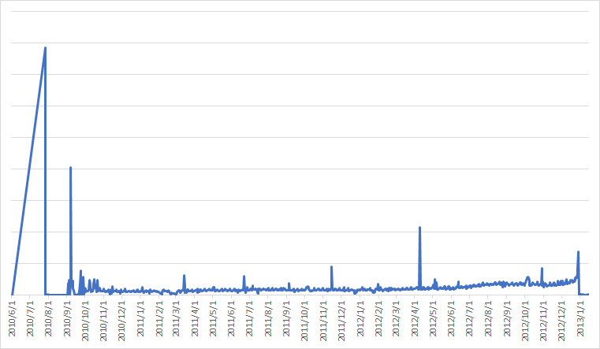
    
33. `id`字段
    1. 估计是auto increment的ID。出现频率为`20039769/20039768(100.00%)`

### References

[1]: https://blog.csdn.net/qq_36561697/article/details/82356106 

[2]: https://zhidao.baidu.com/question/200103085.html
