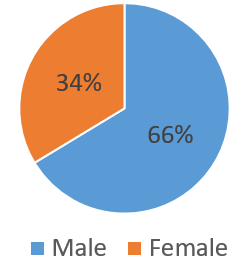
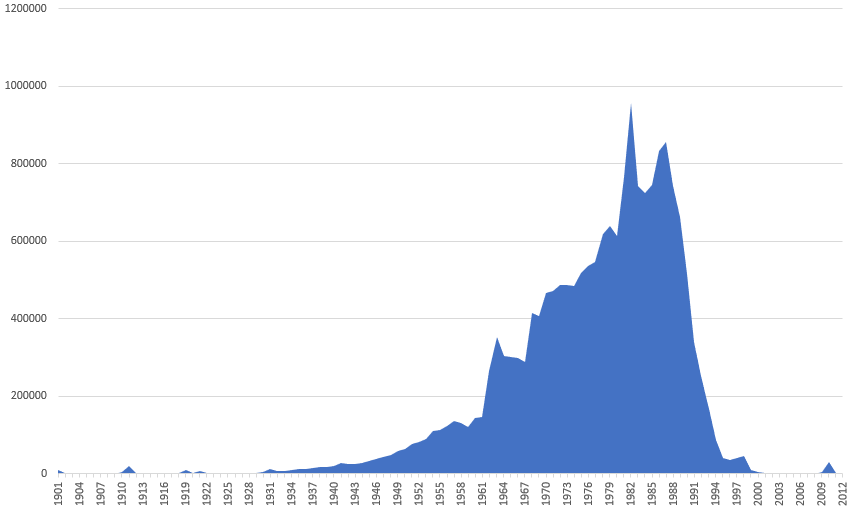

### 汉庭如家2000万条开房记录

### Download

see ./download/download.txt

### ParseResult

一共`20051428`行，不过似乎有`11660`行的数据不太规范，其实里面还是有信息的。
方便起见，这11660行数据不予考虑，即被清洗掉。

1. `Name`字段
    就是名字哒!

2. `CardNo`字段
    1. 看起来没啥意义的说。
    2. 数据分布稀疏且不太均匀，出现频率为`10105/20039768(0.050%)`。
        * 前1000W行里有546行存在此字段，均以`H`或`G`开头，随后辅以7位数字。
        * 后1000W行里有9569行存在此字段，大部分为10位纯数字。

3. `Descriot`字段
    1. 估计是`Description`的缩写。。。`Description -> Descript -> Descriot`(笑)。
    要知道，qwerty键盘上的"P"和"O"键位很近的说。
    2. 数据分布稀疏，出现频率为`20337/20039768(0.101%)`。
        * 主要出现字样为价格/客房类型/服务类型，对客人特殊情况的描述等

4. `CtfTp`字段
    1. 估计是`CtfType`的缩写。
    2. 数据分布稠密，出现频率为`20038723/20039768(99.995%)`。
    3. 有多种类型：
        * `ID`，`18882852/20038723(94.232%)`，
        * `VSA`，`376856/20038723(1.881%)`，
        * `OTH`，`242052/20038723(1.208%)`，
        * `JID`，`120378/20038723(0.601%)`，
        * `TXZ`，`116575/20038723(0.582%)`，
        * `TBZ`，`113951/20038723(0.569%)`，
        * `JZ`，`85726/20038723(0.428%)`，
        * `GID`，`46676/20038723(0.233%)`，
        * `HXZ`，`43815/20038723(0.219%)`，
        * `JLZ`，`4996/20038723(0.025%)`，
        * `hvz`，`2598/20038723(0.013%)`，
        * `SBZ`，`1705/20038723(0.009%)`，
        * `JGZ`，`340/20038723(0.002%)`，
        * `待定`，`76/20038723(0.000%)`，
        * `HKB`，`70/20038723(0.000%)`，
        * `11`，`28/20038723(0.000%)`，
        * `TSZ`，`11/20038723(0.000%)`，
        * `Id`，`11/20038723(0.000%)`，
        * `#ID`，`3/20038723(0.000%)`，
        * `JZ1`，`1/20038723(0.000%)`，
        * `1`，`1/20038723(0.000%)`，
        * `#GID`，`1/20038723(0.000%)`，
        * ` `，`1/20038723(0.000%)`，
     
5. `CtfId`字段
    1. 
    2. 数据分布稠密，出现频率为`20039758/20039768(99.999%)`。
    
6.  `Gender`字段
    1. 此列为性别
    2. 数据频率稠密，出现频率为`19577629/20039768(97.694%)`。
    3. 去除无效数据后，按性别统计(暂只有男/女)结果：
    
        
        
7. `Birthday`字段
    1. 此列为生日(其实从身份证号里也能得到)
    2. 数据分布稠密，出现频率为`19942796/20039768(99.516%)`。
    3. 去除无效及明显不合理数据后，按年计算生日分布：
    
        
        
8. `Address`字段
    1. 似乎是。。。家庭住址？
    2. 出现频率为`16641249/20039768(83.041%)`。
    3. 去除无效数据后，按地区/区域计算地址分布：
    4. 吐槽
        * 天津市有个和平区，沈阳市也有个和平区
    
    
        
        
        
        
        
        
        

, , Zip, Dirty, \
District1, District2, District3, District4, District5, \
District6, FirstNm, LastNm, Duty, Mobile, \
Tel, Fax, EMail, Nation, Taste, \
Education, Company, CTel, CAddress, CZip, \
Family, Version, id

### References

1. [https://blog.csdn.net/qq_36561697/article/details/82356106](https://blog.csdn.net/qq_36561697/article/details/82356106)